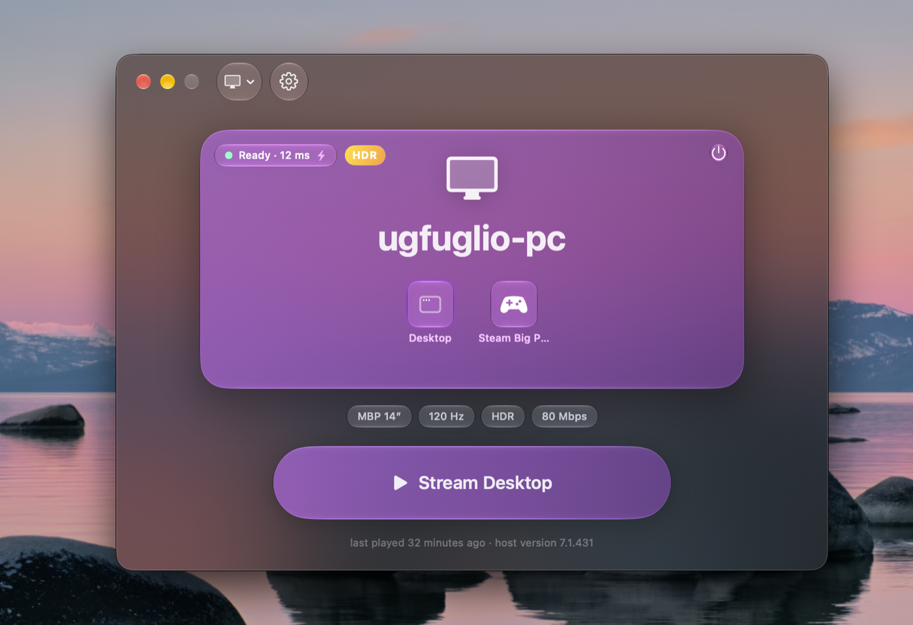

<p align="center">
  
</p>

# shimmer

A Mac-native client for [Sunshine](https://github.com/LizardByte/Sunshine) that
can pop the game out into macOS's floating **Picture in Picture** window - so it
stays in a corner while you use other apps, and your controller keeps playing.

shimmer is a fork of [glimmer](https://github.com/Se7enbrc/glimmer) by
[Se7enbrc](https://github.com/Se7enbrc): pure Swift, Apple Silicon only, the
whole pipeline - socket, decoder, display, audio, input - in one process with no
external player and no C engine. Everything glimmer does, shimmer does. The name
is a nod to the moonlight → sunshine → glimmer lineage it sits in.



## What shimmer adds

- **Picture in Picture.** Press **⌃⌥P** during a stream (rebindable in
  Settings › Shortcuts) and the game moves into the same floating,
  corner-snapping window macOS uses for movies - on top of your other apps.
  It's fed by the very layer the fullscreen window paints into, so there is no
  second decode path and no extra latency; the frame pacer just rides the
  display's own refresh instead of the now-hidden window's. Controllers keep
  driving the game from the corner. Keyboard and mouse stay with whatever app
  is frontmost, the way any PiP video behaves.
- **Pop out automatically** when you switch away from the stream (Settings ›
  Streaming, on by default). Close the PiP window and the stream simply waits
  in the background like a Cmd-Tab-away; the return button, the Dock icon, or
  the menu bar brings it back full screen.
- **Works around two macOS AVKit bugs** in sample-buffer PiP that would
  otherwise show only the bottom-left corner of the picture with a black box on
  top (Apple FB22411168). Design notes and the manual test plan live under
  [`docs/superpowers/specs/`](docs/superpowers/specs/).

## What you get

- **Video.** Hardware-decoded H.264, HEVC, and AV1, 8- and 10-bit, with a real
  PQ/HLG HDR pipeline. Up to 4K 240 Hz.
- **Pacing.** Locks the display to the stream cadence, runs passthrough on a
  clean link, buffers only for measured jitter. Tuned against per-frame
  telemetry.
- **Audio.** Opus through AVAudioEngine with a small adaptive cushion, so device
  switches and rough Wi-Fi don't crackle.
- **Controllers.** Xbox and DualSense: rumble, trigger rumble, gyro, touchpad,
  battery, light bar - whatever the pad has. Hold-to-quit chord. An optional
  raw-input mode (off by default, needs Input Monitoring) adds the DualSense
  buttons macOS hides and the host's adaptive-trigger effects.
- **Mouse and keyboard.** Raw 1:1 aim with the Mac's pointer acceleration
  removed, a velocity-gated boost on fast flicks, optional ⌘-shortcut
  forwarding.
- **Wi-Fi.** An optional helper parks AWDL (AirDrop's radio time-share) during a
  stream - the usual cause of multi-second Wi-Fi freezes.
- **Hosts.** mDNS discovery, PIN pairing, hosts by IP or name (Tailscale works),
  one-time import of moonlight-qt pairings.
- **Mac things.** Menu bar item, display-matched quality presets, stats overlay,
  hotkeys.

Nothing leaves your Mac. Diagnostics are off by default and write local files
under `~/Library/Logs/Shimmer`.

## Install

macOS 26+, Apple Silicon. Build from source (below) - shimmer isn't in a
Homebrew tap yet, and it does not auto-update (the upstream update feed is
deliberately disconnected so a shimmer build never replaces itself with stock
glimmer).

Signed ad-hoc when built locally, not sandboxed, not on the App Store - the
Wi-Fi helper needs that freedom ([docs/SECURITY.md](docs/SECURITY.md)).

Your host needs Sunshine and a display that can present the exact mode you ask
for: a virtual display driver on Windows, a current Sunshine on Linux.
[docs/HOST_SETUP.md](docs/HOST_SETUP.md).

The Wi-Fi helper lives in Settings > Quality > Wi-Fi; macOS asks for one
approval under Login Items & Extensions. If it reports `rejected by BTM`, run
`sudo sfltool resetbtm` once.

## Build

Xcode 26 (Swift 6) and Homebrew.

```bash
git clone https://github.com/kevinbpatel/shimmer.git
cd shimmer
brew install openssl@3 opus
make
```

`make` builds and installs `/Applications/Shimmer.app` the same way a release
ships. `make app` compile-checks, `make test` runs the unit tests,
`make uninstall` removes it. The engine is under `Glimmer/Stream/` (the source
tree and Swift module keep glimmer's name; the app, bundle id
`com.kevinbpatel.shimmer`, and data folders are Shimmer's). Upgrading from a
glimmer install is automatic: on first launch Shimmer copies your pairings,
preferences, and client identity forward, and leaves glimmer's untouched.
[docs/ARCHITECTURE.md](docs/ARCHITECTURE.md),
[docs/CONTRIBUTING.md](docs/CONTRIBUTING.md).

## Why not Moonlight

Moonlight is excellent and glimmer would not exist without it. But moonlight-qt
is a Qt port of cross-platform C++, one layer from the hardware. glimmer - and so
shimmer - talks to VideoToolbox, AVAudioEngine, and GameController directly;
that is where the pacing, HDR, and controller work comes from, and it behaves
like a Mac app because it is one. It is also why Picture in Picture was
tractable here: the stream already renders through an
`AVSampleBufferDisplayLayer`, which is exactly what macOS PiP takes as a source.

## Support

glimmer is free software written in spare time.
[Sponsor its author on GitHub](https://github.com/sponsors/Se7enbrc) if it
makes your setup better.

## License

GPLv3. shimmer is a fork of glimmer, Copyright © 2026 ugfugl.io; shimmer's
additions are Copyright © 2026 Kevin Patel and are released under the same
license. See [LICENSE](LICENSE).

The transport is ported from
[moonlight-common-c](https://github.com/moonlight-stream/moonlight-common-c) and
[moonlight-qt](https://github.com/moonlight-stream/moonlight-qt), both GPLv3, so
glimmer is too, and so is shimmer. Full acknowledgment in
[CREDITS.md](CREDITS.md).
